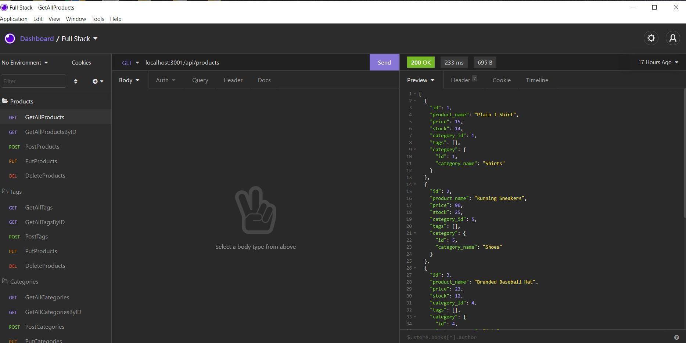

# Ecommerce Backend Application
### Created by: Ahmad Kane




## Description

The purpose of this app is to manage a database of products and tags through API calls.
<br>
A walkthrough of the app can be found [here](https://www.youtube.com/watch?v=Ep6WZy2Gr34&t=24s).

## Table of Contents

- [Installation](#installation)
- [Usage](#usage)
- [License](#license)
- [Contacts](#contacts)

## Installation

To install this application, clone this repo by typing:

```
git@github.com:ahmadkane93/OSU-bootcamp-ecommerce-backend.git
```

Once downloaded, install its dependencies by navigating to the
app's directory by typing:

```
npm install
```

This command will install the following packages: sequelize, express, dotenv, and MYSQL.

A database schema and a seed file are included in the repo. To load the
schema, use mysql in the command line and type:

```
mysql> source db/schema.sql
```
```
mysql> exit
```
To seed the database, type:

```
node seeds/index.js
```

You will need to add a .env file specifying your MYSQL username and
password. 

## Usage

To initiate the app, go to your directory and run the command:

```
node server
```

## License


## Contacts
For additional information, send me an [email](ahmadkanework@gmail.com) or refer to my [Github](https://github.com/ahmadkane93/)
  
